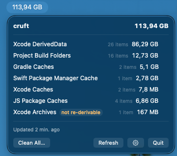

# cruft

A macOS menu bar app that finds the developer build cruft eating your disk —
and cleans it safely.



Xcode DerivedData, temporary DerivedData, agent worktrees, simulator device data, stray in-repo `build/` folders,
Gradle caches, SwiftPM, and npm/yarn/pnpm caches can quietly grow to **tens or
hundreds of GB**. The built-in macOS storage pane is slow, incomplete, and
lumps in things you should never delete. cruft shows the total in your menu
bar, keeps it fresh in the background without ever making your Mac feel busy,
and cleans only the safe categories with one confirmed click.

Re-derivable caches use the normal clean flow. Simulator devices are different:
they contain installed apps and data that cannot be recovered, so cruft deletes
them only through an explicit runtime-subgroup action and a red confirmation.
iOS device support, source code, and unrelated user data remain off limits — see
[Safety model](#safety-model).

> 🚧 Pre-release: fully functional and heavily tested against fixture
> trees, but no notarized binary yet — build from source below. A signed
> release + Homebrew cask are planned.

## What it shows and cleans

| Category | Location | Re-derivable? |
|---|---|---|
| Xcode DerivedData | `~/Library/Developer/Xcode/DerivedData` (per-project) | ✅ rebuilds on next build |
| Temporary DerivedData | direct Xcode-shaped `*DerivedData*` folders under `/private/tmp` | ✅ rebuilds; explicit item deletion only after 72 h without changes and a live-use check |
| Project build folders | `build/`, `.build/`, `.gradle/` next to project markers under your projects root | ✅ rebuilds |
| Claude & Codex worktrees | direct children of `.claude/worktrees` and `.codex/worktrees` under each repository | ⚠️ explicit item deletion only; clean, unlocked, contained in the local primary branch, unchanged for 72 h, and not active |
| Gradle caches | `~/.gradle/caches`, `~/.gradle/daemon` | ✅ re-downloads/rebuilds |
| SwiftPM cache | `~/Library/Caches/org.swift.swiftpm` | ✅ re-downloads |
| Xcode caches | `~/Library/Caches/com.apple.dt.Xcode`, CoreSimulator **Caches** | ✅ regenerates |
| Simulator device data | `~/Library/Developer/CoreSimulator/Devices` (per device) | ⚠️ not re-derivable — grouped by Xcode/Other and runtime; explicit subgroup deletion only |
| XcodeBuildMCP workspaces | `~/Library/Developer/XcodeBuildMCP/workspaces` | ✅ rebuilds on next MCP build |
| JS package caches | `~/.npm/_cacache`, Yarn, pnpm caches/store | ✅ re-downloads |
| Xcode Archives | `~/Library/Developer/Xcode/Archives` | ⚠️ **NOT re-derivable** (release dSYMs) — excluded from Clean All by default, explicit per-category clean with a red warning |

Simulator devices appear under exactly two headings. **Xcode** contains devices
whose names match their standard CoreSimulator device type. **Other** contains
custom names, including Flow-created devices, plus unclassified devices.
CoreSimulator does not record creator identity, so cruft does not claim that
every device under Other came from Flow. Each heading is divided into runtime
groups such as `iOS 26.4`, `iOS 26.5`, and `watchOS 26.5`.

Only a complete runtime subgroup can be deleted. A group is disabled if any
device is booted, not ready, or has unknown metadata. The simulator parent,
Xcode/Other headings, Clean All, Settings, and `cruft-cli clean` cannot perform
bulk simulator deletion.

Temporary DerivedData and agent worktrees are also never part of Clean All.
Each directory has its own action. The action stays disabled until a complete
metadata scan shows no change for at least 72 hours. Immediately before
deletion, cruft scans the age again and refuses any directory with an open file,
process working directory, or process command line that refers to it.

Worktrees have additional local Git checks. They must be registered, clean,
unlocked, and fully contained in `main`, `master`, the local origin default, or
`develop` (in that order). Cruft then runs `git worktree remove` without
`--force`, so Git performs a final dirty and lock check. No remote or pull
request service is contacted.

Never deleted: `/private/tmp` itself, any `.claude/worktrees` or
`.codex/worktrees` root, the CoreSimulator **Devices root**, iOS/watchOS DeviceSupport,
Android AVDs, `.git`, iCloud Drive, `node_modules` (v1), Gradle wrapper
distributions, and anything outside your home directory.

## Safety model

cruft deletes files, so it is engineered like it.

- **One deletion choke point.** Every byte that leaves the disk goes through
  a single audited type, [`SafeDeleter`](CruftKit/Sources/CruftKit/SafeDeleter.swift).
  A CI check ([`Scripts/check-chokepoint.sh`](Scripts/check-chokepoint.sh))
  fails the build if any other production code acquires a file-removal API.
- **Eight generic rules, all must pass**, compared on canonical
  (symlink-resolved) paths on both sides: inside your home; home-override
  backstop (only the real `$HOME` or a temp-area test fixture is accepted);
  inside the category's allowed roots; a hard **denylist** (`.git`, `Devices`,
  `DeviceSupport`, `.avd`, `UserData`, iCloud's `Mobile Documents`) that beats
  the allowlist; a depth floor; symlinks deleted as links, never followed; must
  exist and be owned by you; and a dry-run mode that runs every check without
  touching anything.
- **Simulator deletion has a narrower mode.** `Devices` stays denylisted for
  every generic clean. Simulator mode accepts only one real, direct UUID child
  of the exact canonical CoreSimulator Devices root. It re-reads `device.plist`,
  requires matching metadata and shutdown state, then calls
  `xcrun simctl delete <UDID>` instead of removing the directory directly.
- **Temporary and worktree deletion have guarded modes.** Temporary items must
  be direct `/private/tmp` children with an Xcode `Build` signature. Worktrees
  must be direct registered Claude/Codex children with safe local Git state.
  Both modes require a complete 72-hour age measurement and a live-use check
  at the deletion choke point. Worktrees are removed by Git without force.
- **Adversarially tested.** The test suite includes named attack fixtures —
  symlinks escaping home, symlinks into `.git`, mis-cased denylist
  components on case-insensitive APFS, `..` traversal, depth-floor edges —
  plus a conformance suite that pushes every cleanable item through the real
  SafeDeleter in dry-run and verifies that view-only items refuse deletion.
- **Nothing is deleted without a confirmation dialog**, which shows exactly
  what will be removed and warns if Xcode or a Gradle daemon is running.
  Archives and simulator subgroups show their own red, non-recoverable warning.
- **Honest numbers.** Freed space is measured as the volume's free-space
  delta (`statfs`), not per-file sums — APFS clones can't inflate it.

## Polite by design

Scanning ~100 GB of caches without making your Mac feel slow is most of the
engineering here:

- Sizing is a **pure metadata walk** — payload file contents are never read.
  Simulator discovery reads the small `device.plist` directly in each device
  directory to classify its name, runtime, UDID, and current state.
- Scheduled scans run at background QoS, which gets kernel-throttled disk
  I/O; user-initiated scans never run above utility priority.
- A **quiet gate** skips scanning DerivedData while a build is actively
  writing into it; low power mode, thermal pressure, and low battery defer
  scheduled scans.
- Last-known sizes persist, so the menu opens instantly with
  "updated X ago" while fresh numbers stream in — totals never flicker or
  shrink mid-scan.
- Background rescan every 4 h (configurable), refresh-on-open when stale,
  and instant invalidation when something else cleaned a cache externally.

## Install

Build from source (Xcode 16+):

```sh
git clone https://github.com/Jasonvdb/cruft.git
cd cruft
xcodebuild -project Cruft.xcodeproj -scheme Cruft -configuration Release build
```

First scan of your projects folder triggers the standard macOS prompt for
access to `~/Documents` — that's the OS, not us phoning home (cruft has no
network code at all).

## cruft-cli

Everything the app does is scriptable:

```sh
swift run --package-path CruftKit cruft-cli scan --json
swift run --package-path CruftKit cruft-cli clean --category derived-data            # dry run
swift run --package-path CruftKit cruft-cli clean --category derived-data --yes      # delete
```

`clean` is dry-run by default. Deleting from your real home requires an
extra explicit flag beyond `--yes` (it tells you which). The CLI lists
simulator data, temporary DerivedData, and agent worktrees in scan totals but
refuses whole-category cleanup for them, including dry-run requests. Their
deletion actions are available only from the app's exact subgroup or item
controls.

## Extending

A cache category is one small type conforming to
[`CacheSource`](CruftKit/Sources/CruftKit/CacheSource.swift) (discover items
+ declare allowed deletion roots) plus one registry line. Rust `target/`
dirs, CocoaPods, ccache — PRs welcome; the conformance suite automatically
holds any new source to the same safety rules.

## Development

```sh
swift test --package-path CruftKit        # hermetic (fixture homes in /tmp)
./Scripts/check-chokepoint.sh             # single-deletion-site invariant
swift run --package-path CruftKit cruft-cli fixture /tmp/cruft-fixture   # canonical test tree
```

## License

MIT — see [LICENSE](LICENSE).
